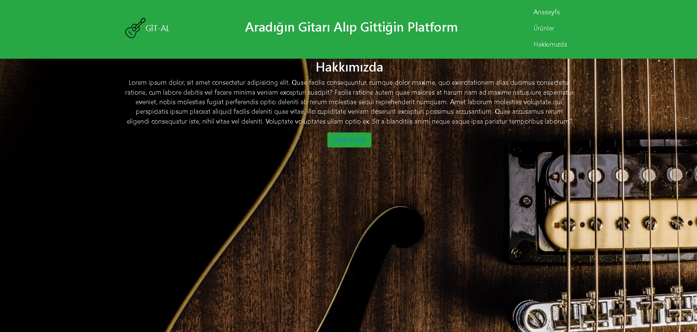
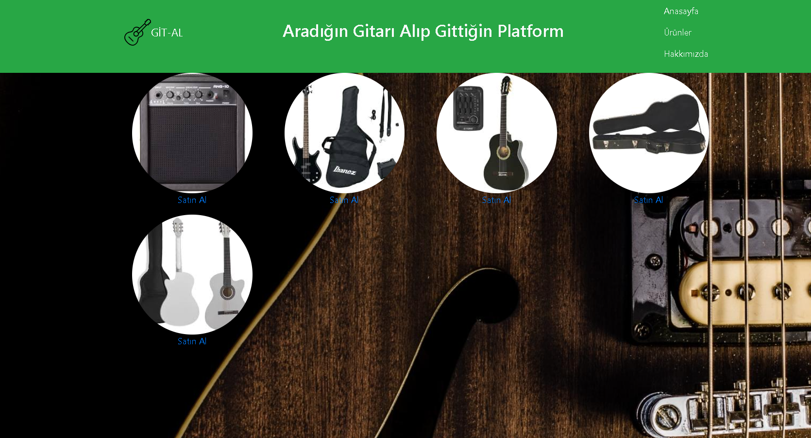

# Müzik Marketi Web Sitesi Projesi

Bu proje, HTML, CSS ve Bootstrap kullanılarak bir müzik marketi web sitesinin oluşturulmasını amaçlamaktadır. Bu README dosyası, projenin yapısı, içeriği ve kullanımı hakkında genel bilgiler sağlar.

## Proje Amaçları

- Müzik marketi web sitesi oluşturmak.
- Kullanıcıların müzik albümlerini keşfetmelerine ve satın almalarına olanak sağlamak.
- Kullanıcıların aradıkları albümleri kolayca bulmalarını sağlamak için kullanıcı dostu bir arayüz sunmak.

## Kullanılan Teknolojiler

Bu proje HTML, CSS ve Bootstrap ile geliştirilmiştir.

- **HTML:** Web sayfası yapısını oluşturmak için kullanılmıştır.
- **CSS:** Sayfa stillerini belirlemek ve tasarımı özelleştirmek için kullanılmıştır.
- **Bootstrap:** Hızlı ve duyarlı bir kullanıcı arayüzü oluşturmak için kullanılmıştır.